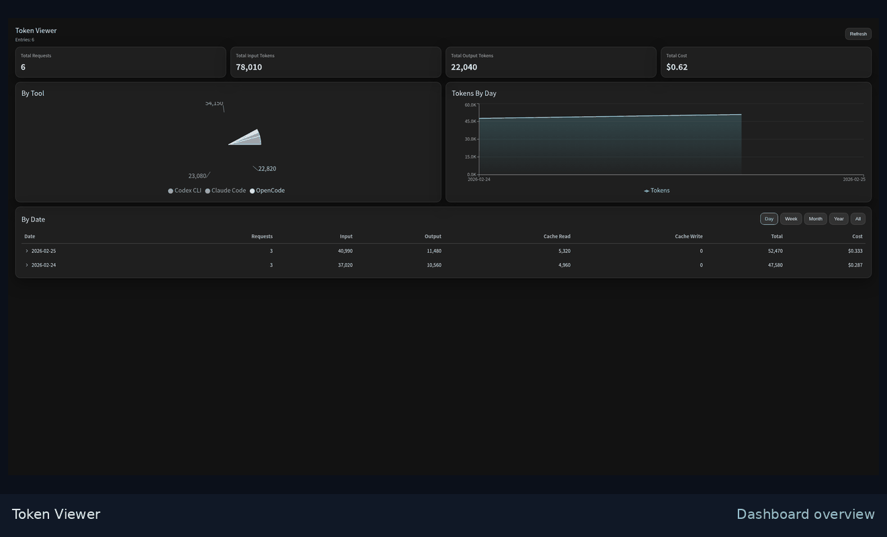
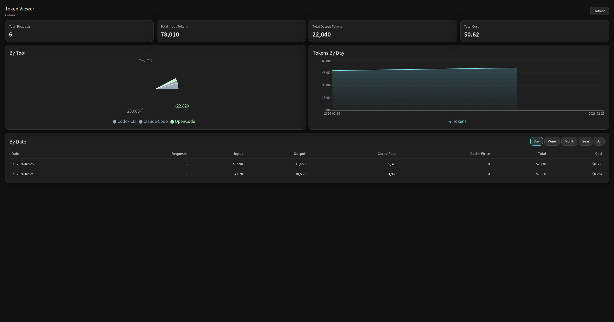
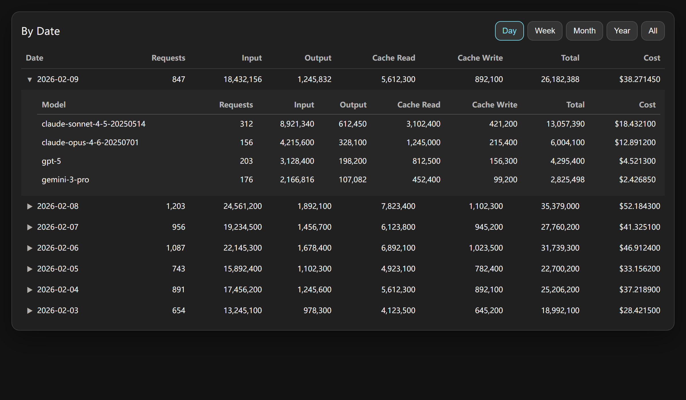
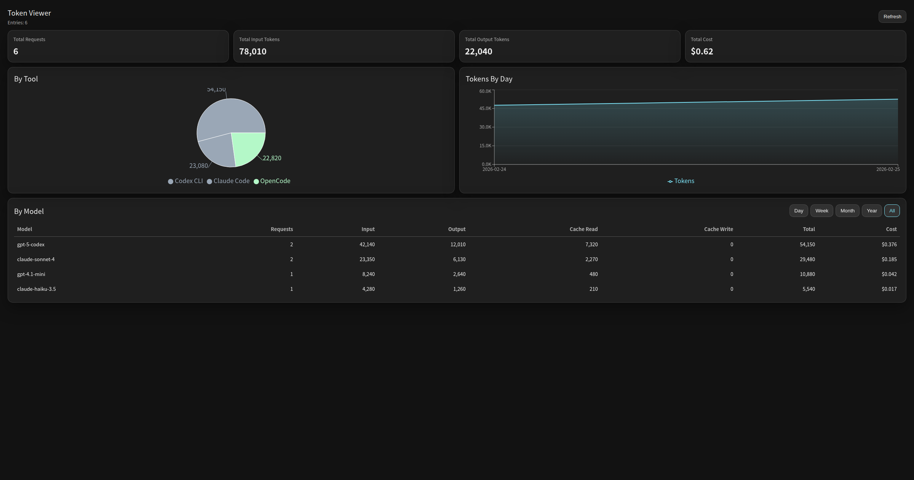

# Token Viewer — Claude Code / Codex / OpenCode 的 Token 与成本分析工具

[](https://github.com/chadyi/token-viewer/releases)
[](https://github.com/chadyi/token-viewer/actions/workflows/build.yml)
[](./LICENSE)

Token Viewer 是一个**本地优先（Local-first）**的桌面应用，用来统计和可视化：
- Token 使用量
- 模型成本估算
- 按日期 / 模型的趋势变化

支持数据来源：
- Claude Code
- Codex CLI
- OpenCode

技术栈：**Tauri v2 + React 19 + TypeScript**。

> 如果这个项目对你有帮助，欢迎点个 Star ⭐

## 快速演示



---

[English](./README.md) | 简体中文

## 解决什么问题

很多人能看到日志，但很难快速回答：
- 今天（或本周）到底用了多少 token？
- 哪个模型最贵？
- 缓存带来的收益到底有多大？

Token Viewer 会把本地日志整理成可读的仪表盘和明细表。

## 主要功能

- **纯本地扫描**：不上传日志
- **增量刷新快**：记住文件 offset，刷新耗时低
- **Dashboard**：请求数 / 输入输出 token / 总量 / 成本
- **成本估算**：基于 LiteLLM 定价（含分层价格）
- **日期维度**：Day / Week / Month / Year / All
- **模型明细展开**：按日期点击展开查看每个模型
- **跨平台**：Windows / macOS（Intel & Apple Silicon）/ Linux

## 截图

### 总览面板


### 按日期查看（可展开）


### 按模型查看（All）


## 下载

请在 **[Releases](https://github.com/chadyi/token-viewer/releases)** 页面下载对应平台安装包。

## 支持的日志路径

- **Claude Code**
  - `~/.config/claude/projects/**/*.jsonl`
  - `~/.claude/projects/**/*.jsonl`
- **Codex CLI**
  - `~/.codex/sessions/**/*.jsonl`
- **OpenCode**
  - `~/.local/share/opencode/storage/message/**/*.json`

## 本地开发

### 依赖

- Node.js 22+
- Rust stable
- Tauri v2 prerequisites

### 启动开发

```bash
npm install
npm run tauri dev
```

### 构建

```bash
npm run tauri build
```

## 许可证

MIT
